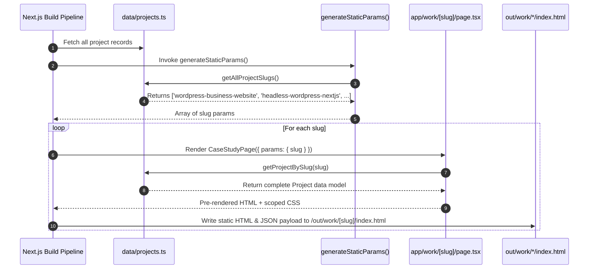
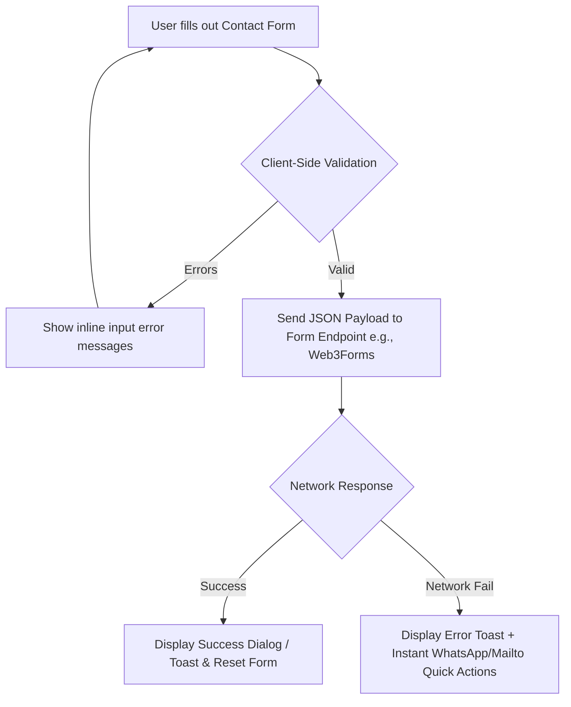
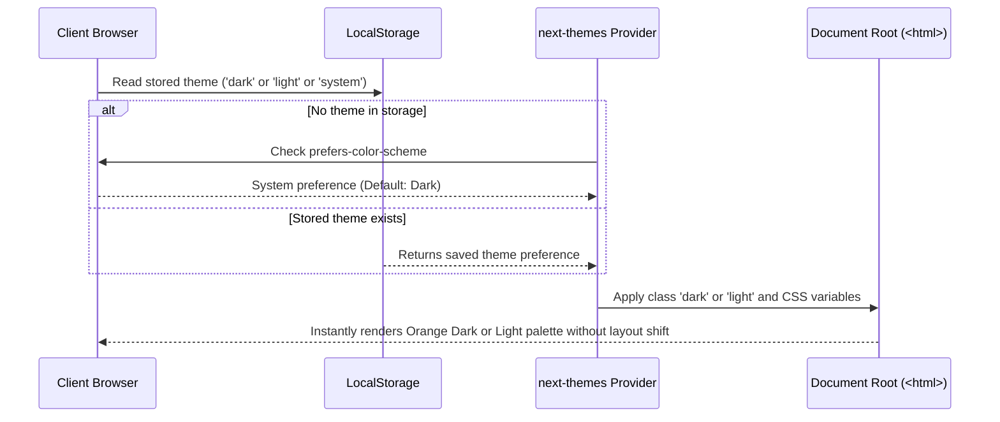
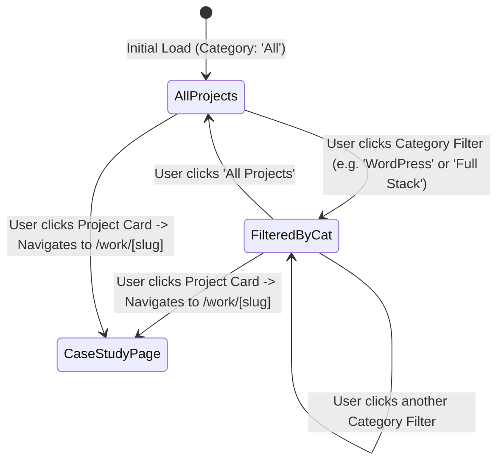
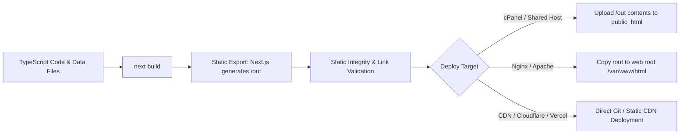

# Application, User & System Flow Specifications

This document defines the user interaction journeys, client conversion funnels, data flow lifecycle, and build pipelines for the **Heera Singh Portfolio & Freelance Platform**.

---

## 1. High-Converting Freelance Client Funnel

The website is structured as an intentional conversion funnel that transforms cold visitors (business owners, founders, CTOs, recruiters) into qualified project inquiries.

```mermaid
flowchart TD
    A[Visitor Lands on Homepage] --> B[Hero Section: Value Proposition & Impact]
    B --> C[What I Build: High-Level Capabilities]
    C --> D[Services Section: Specific Client Offerings]
    D --> E[Featured Work: Real World Proof & Metrics]
    E --> F{Visitor Action}
    
    F -->|Wants Details| G[Case Study Deep Dive: /work/[slug]]
    F -->|Evaluates Fit| H[Why Choose Me & 4-Step Process]
    F -->|Ready to Hire| I[Primary CTA: 'Start a Project']
    
    G --> J[Results, Architecture & Stack Breakdown]
    J --> I
    
    H --> K[Tech Stack, About & Social Proof]
    K --> L[FAQ Section: Objection Handling]
    L --> I
    
    I --> M[Contact Page / Project Inquiry Form]
    M --> N[Lead Conversion: Email / Discovery Call]
```

### Stage-by-Stage Funnel Breakdown

| Stage | Section / Component | Visitor Mindset | Outcome / Next Step |
| :--- | :--- | :--- | :--- |
| **1. Hook & Clarity** | `HeroSection` (`app/page.tsx`) | *"Can this developer solve my business problem?"* | Clear value statement, primary `"Start a Project"` button, social proof badges. |
| **2. Capability Match** | `WhatIBuild` & `ServicesPreview` | *"Do they build what I need (Next.js, Web Apps, Custom WordPress, APIs)?"* | Quick service cards with clear deliverables. |
| **3. Evidence & Proof** | `FeaturedWork` (`components/projects/`) | *"Have they successfully delivered similar projects before?"* | Metrics-focused cards linking to deep-dive case studies. |
| **4. Deep Validation** | `CaseStudyView` (`app/work/[slug]/`) | *"How do they think, architect, and overcome technical hurdles?"* | Comprehensive challenge, architecture, tech stack, and measurable results. |
| **5. Trust & Process** | `WhyMe` & `ProcessSection` | *"What is it like to work with Heera? Is there a predictable process?"* | 4-step workflow (Discover -> Design & Architect -> Develop -> Launch & Support). |
| **6. Credibility** | `TechStack`, `AboutPreview`, `Testimonials` | *"What are their credentials, experience (MadQuick, Stack Console), and tools?"* | Verified experience, tech badges, and client feedback. |
| **7. Objection Removal** | `FAQSection` | *"What about pricing, timelines, contracts, or post-launch support?"* | Transparent answers removing hesitation. |
| **8. Conversion** | `CTABanner` & `ContactPage` (`app/contact/`) | *"I'm ready to discuss my project."* | Streamlined form, direct WhatsApp option, and booking link. |

---

## 2. Dynamic Routing & Static Generation Flow

Since the application is exported statically (`output: 'export'`), all dynamic routes are pre-rendered at build time.



---

## 3. Case Study Deep-Dive Reading Flow (`/work/[slug]`)

When a user visits a case study page, the layout guides them through an engineering narrative:

```text
┌──────────────────────────────────────────────────────────────┐
│  CASE STUDY HEADER: Title, Client, Role, Year, Category       │
│  Live Demo Link (if public) • GitHub Source Link (if open)   │
├──────────────────────────────────────────────────────────────┤
│  METRICS STRIP: Key Results (e.g., +200% Speed, 99.9% Uptime)│
├──────────────────────────────────────────────────────────────┤
│  OVERVIEW GRID:                                              │
│  - The Business Challenge / Problem Statement                │
│  - The Strategic & Engineering Solution                      │
├──────────────────────────────────────────────────────────────┤
│  SYSTEM ARCHITECTURE & TECHNICAL DECISIONS:                  │
│  - Architecture diagram or structural breakdown              │
│  - Key packages, tools, and design choices                   │
├──────────────────────────────────────────────────────────────┤
│  IMPLEMENTATION HIGHLIGHTS & SCREENSHOT SHOWCASE             │
├──────────────────────────────────────────────────────────────┤
│  FINAL OUTCOME & BUSINESS IMPACT                             │
├──────────────────────────────────────────────────────────────┤
│  FOOTER NAVIGATION: Previous Project • Next Project • CTA    │
└──────────────────────────────────────────────────────────────┘
```

---

## 4. Client-Side Contact & Lead Capture Flow

With zero backend server code running in production, contact interactions run purely client-side with fail-safe redundancies:



---

## 5. Theme Switching & Hydration Flow

Theme toggle ensures a seamless transition without flash of unstyled content (FOUC):



---

## 6. Project Catalog Filter Flow (`/work`)



---

## 7. Static Build & Production Deployment Flow


